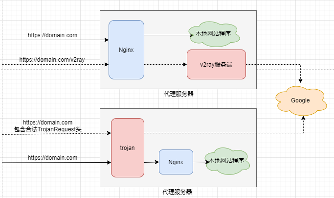
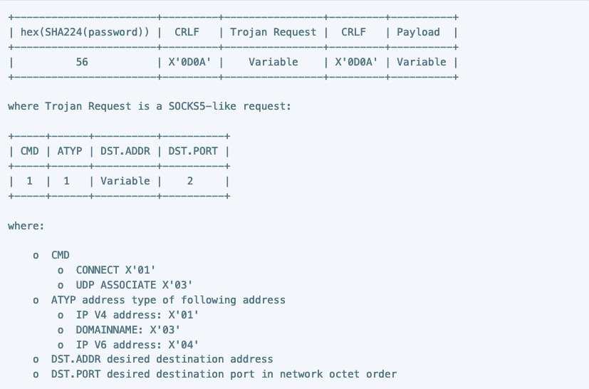

# 什么是Trojan
Trojan, 一种新的代理协议, 和来自V2Fly的VMess/VLESS协议相比较, Trojan更容易躲过墙

### 前言
墙和破墙者都一直在进化, 自从今年某大以后, 墙一直处于高强度的ip封锁中. 而V2Ray和Shadowsocks都可以被墙的探针(主动识别功能)探测出来. 在这种情况下Proxy开发者们想出了几个殊途同归的想法.  

### SoH
在认识Trojan前先讨论SoH(Shadowsocks on HTTPS), 通过在HTTPS上建立Shadowsocks连接来规避墙.  
因为SoH相当于一个HTTPS连接, 墙很难探测出你访问的到底是真实网站 or Shadowsocks. 也不能把所有HTTPS都搞掉.  
就此SoH规避了墙. 这种方法仍然可能被攻击(例如如果真的想搞的话可以利用国家力量签发假证书搞大范围的中间人攻击,那样的话所有运行在TLS层上的连接都相当于可见范围), 但不属于谈论范围.  

### Trojan
Trojan更加安全, 让我们先来说说结构  
当请求到达服务器时, 如果发送的是合法的Trojan包, 且密码正确, 那么Trojan会Handle这个请求  
反之, Trojan Server将请求转到Nginx负责, 通常会展示一伪装页面  
Trojan的结构图:  

V2Ray需要放在Nginx后面, 而Trojan放在Nginx前面, 这样可以让Trojan先处理请求, 如果不是Trojan请求, 那么就交给Nginx处理.

### 几个不同的版本
成熟的, 正常维护的(Well Maintained)版本有两个, [Trojan-GFW/Trojan](https://github.com/trojan-gfw/trojan)和[Trojan-go](https://github.com/p4gefau1t/trojan-go)  
Trojan-GFW/Trojan是基于C++的原始实现, 协议的细节位于其Github Pages上, 目前这个GH Page已经被封了(开加速无法访问, 需要开代理出海).

### 更深入的细节
Trojan协议运行在`TLS`层上, 和普通的SSL/TLS连接一样, 当TLS连接到服务器以后, Client会发送以下包

包括头部的16进制SHA224密码哈希, 中间为Trojan Request, 末尾为Payload.
Trojan Request包括以下内容
- CMD, 1字节, 0x01为CONNECT, 0x03为UDP ASSOCIATE
- ATYPE, Address Type, 1字节, 0x01为IPv4, 0x03为域名, 0x04为IPv6
- DST.ADDR, 目标地址
- DST.PORT, 目标端口
可以说, Trojan协议简洁却不失强大, 能够实现日常的大多数浏览需求.

### 参考材料
- [Trojan-GFW/Trojan](https://github.com/trojan-gfw/trojan)
- [Trojan-go](https://github.com/p4gefau1t/trojan-go)
- [Trojan Docs](https://trojan-gfw.github.io/trojan/protocol)